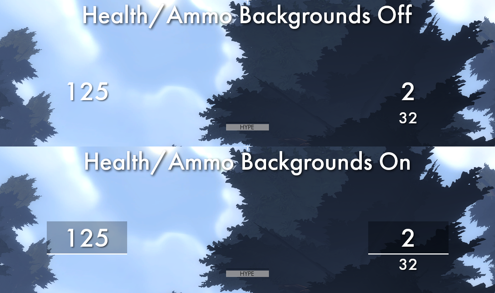
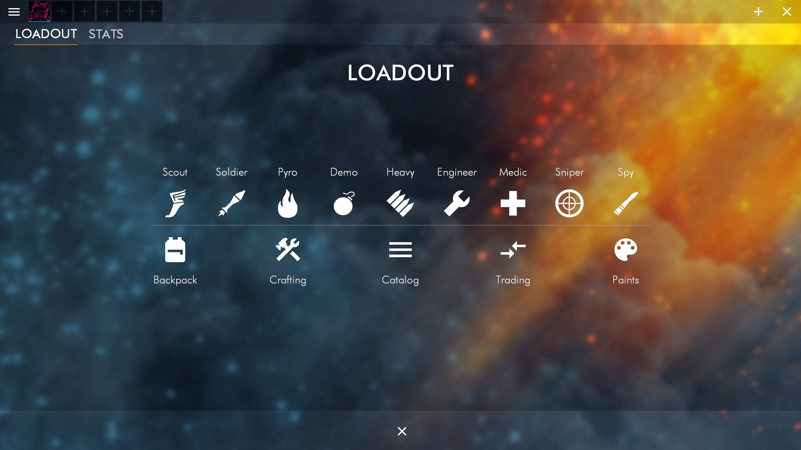
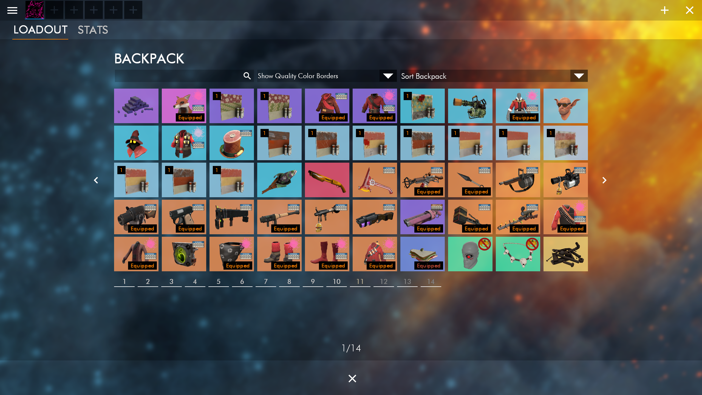

---

# About

OneHUD is a modern, stylistic HUD themed around **Battlefield 1** and **Battlefield V**. Flat colors and a simple layout make the hud easy on the eyes and makes customization a breeze.

# Installation

Copy the `onehud-main` file from the zip you downloaded into the `/tf/custom/` directory.

# Customization

In OneHUD, you can select a custom crosshair, custom hitmarker, and custom colors.

## Crosshair

The crosshairs can be customized in the `/customizations/crosshair.res` file. You have many options for this:

## Hitmarker

Hitmarker options are limited but they are there. A total of 6 hitmarker choices are available in the `/customizations/hitmarker.res` file.

## Colors

Many of the hud elements' colors can be easily customized from the `/customizations/colors.res` file, including crosshair and hitmarker colors. Most of the options here are self-explanitory. 

## Favorite servers

You can save up to 3 favorite servers as bookmarks. The servers can then be quickly joined using the `MORE` button on the main menu, and then under the favorite servers section of the `MORE` panel. You can edit these servers in the `/customizations/servers.res` file.

## Health & Ammo

The `cl_hud_minmode` command changes the health and ammo positions on your hud. `cl_hud_minmode 0` makes the health and ammo appear in their usual positions, while `cl_hud_minmode 1` makes them appear next to your crosshair. This is refered to as **Tactical** health and ammo. This can be used as a way to de-clutter the screen.

You can toggle it with the `cl_hud_minmode <0/1>` command or by pressing the `[+]` button on the `MORE` panel.

## Matchstatus

You can change the match status at the top of the screen to either be `full` (Player icons are shown) or `minimal` (Player icons are not shown). This can be changed in `/customizations/matchstatus.res`.

## Scoreboard

There are four options for the scoreboard, `16v16`, `12v12` (default), `9v9`, or `6v6`. Options can be easily chosen from the `customizations/scoreboard.res` file.

## Low health effect

You can enable a transparent red border around your screen when your health gets low, similar to what you may find in other shooters. In `/customizations/low_health_effect.res`, you can change the `visible` and `enabled` values from `0` to `1` to toggle it on or off.

## Health and ammo backgrounds

You can enable a transparent background behind your health and ammo for increased visibility or aesthetic purposes. In `/customizations/health_bg.res` and `/customizations/ammo_bg.res`, add or remove the two slashes behind `#base "/...` to enable or disable it.

# Screenshots

## Main Menu

## Main Menu (Ingame)

## Loadout

## Backpack

## Team select

## Class select

## Payload

## 5CP/Attack/Defend

## CTF

## KOTH

# Credits

- n0kk : ahud
- Fraxinus : Testing
- Hypnotize : Class icon font